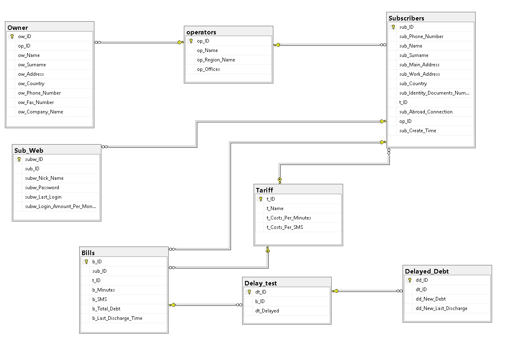

# GSM-Database

<html>
  <body>
    
    
    <h1>English</h1>
    
I made a database for a GSM Company

    
    <h1>Turkish</h1>
    
Bir GSM Şirketi için Veritabanı yaptım.

    
    
    
    <h1>English</h1>
    
    
For this query, I don't have any region end with "Y" and any branch which has 3 letter in name, so I use "N" for region name and 5 letter for branch name.
    

    
    <h1>Turkish</h1>
    
Bu sorgu için elimde hiç 'Y' ile biten bölge ve 3 harfli alt bayi yoktu bu yüzden bölge için 'N' harfini ve alt bayi için 5 harfli olmasını kullandım.

    
    
    
    <h1>English</h1>
    
 For this one, because of I didn't add lots of subscribers, many branch has 0 subscrbers.

    
    
    
    <h1>Turkish</h1>
    
 Bunun için, çok fazla abone eklemediğimden dolayı çoğu alt bayinin 0 abonesi var.

    
    
    
    
    <h1>English</h1>
    
To not see any Unnecessary Bills' columns in result, I add lots of column name

    
    <h1>Turkish</h1>
    
Gereksiz Bills kolonlarını görmek istemediğim için bir sürü kolon adı ekledim.

    
    
    <h1>English</h1>
    
I add 'Balıkesir' branch for this query.

    
    
    <h1>Turkish</h1>
    
Bu sorgu için 'Balıkesir' alt bayisini ekledim.

    
    
    
    
    
   <h1>English</h1>
   
I add a login with name of 'arda' and give it only select permission.

   
   <h1>Turkish</h1>
   
'arda' isminde bir giriş ekledim ve ona sadece sorgulama yetkisi verdim.

   
   
   
   <h1>English</h1>
   
This query has lots of column name again because I didn't want to see any Bills' columns, and I Calculate Subscribers debt which use ZOOM tariff

   
   <h1>Turkish</h1>
   
Bu sorguda yeniden çok fazla kolon adı ekledim çünkü Bills kolonlarını görmek istemiyordum. Ve ZOOM tarifesini kullanan abonelerin borçlarını hesapladım

   
   
   
   <h1>English</h1>
   
I add lots of columns name for this one, to not see any columns name which is for sub_web table. I find subscriber who has the most login amount to website.

   
   <h1>Turkish</h1>
   
Sub_web tablosunu görmemek için buraya çok fazla kolon adı ekledim. Websitesine en çok giriş yapan aboneyi buldum.

  </body>
</html>   
